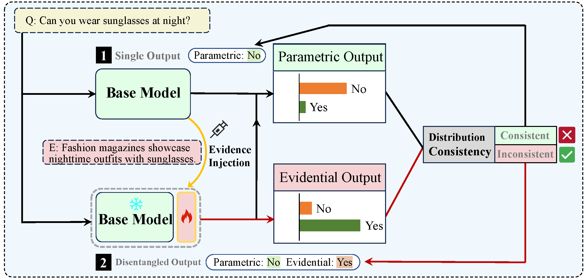

# Scenarios-aware Commonsense Correcton via Instance-level Knowledge Injection 


## Abstract 
Large language models are beneficial for various natural language tasks. However, outdated knowledge in their parameters lead to erroneous outputs. To address it, researchers have proposed methods for editing the model to update the knowledge. Nevertheless, these approaches have not explored the use of instance-level information to guide desired outputs, nor have they effectively rectified commonsense errors in specific contextual scenarios. To tackle this, we establish a benchmark for evidence-based commonsense correction in question-answering. We propose assessment metrics and employ a self-retrieval strategy to extract relevant evidence. Using a hypernetwork, we dynamically inject evidence during correction, yielding improved results over baseline methods.


## Experiments

````
cd commonsense_edit
````


## structure
````
.
├── config
│     ├── editor(method setting)
│     │── experiment(dataset)
│     │── model (setting)
│  
│── dataset
│
│── editor(all methods)
│
│── modeling(detail modules)
│
│── scripts

````

## Citation
Paper is accepted at [__DASFAA 2024__](https://www.dasfaa2024.org/) (short paper). 
Citation format will be updated soon.

````
